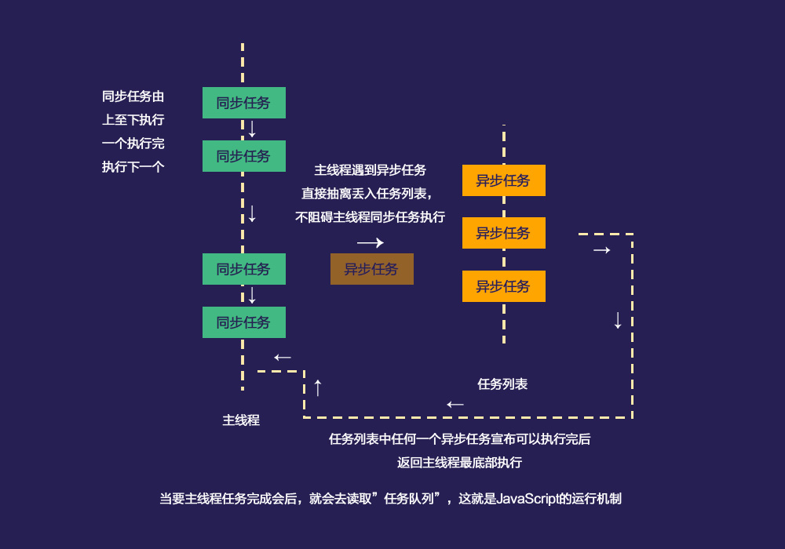

# Javascript

Javascript 是 `单线程` 的，是**`动态类型`**，**`弱类型语言`**，**`解释型语言`**，具有**交互性**，它不需要编译便可以直接运行在浏览器中。
直译语言灵活性比较弱，如果一条执行不了，下面的语言就无法运行了。<br><br>

<strong> 举个例子：</strong><br>
在没有声明变量 'a,b,c' 的情况下，直接运行代码会报错 `a is not defined` ，并且中断执行。


```copy
console.log(a)                      //抛出错误异常 'a is not defined' 中断执行。
console.log(b)                      //不执行
console.log(c)                      //不执行
console.log('hello world')          //不执行
```
<br>
<br>

#### 动态类型语言

<strong>为什么说是 '动态类型'</strong>
>静态类型：在编译阶段就做类型检查的类型。（typescript 也是静态类型语言）<br><br>
**动态类型：Javascript 在执行阶段才做类型检查的类型。**（python 也是动态类型语言）

**举个例子：**

```copy
var text = 1;
text();                     //VM339:2 Uncaught TypeError: text is not a function
```

!>上面这个例子中，`Javascript` 在运行中才会报错提示 `text is not a function`，所以说 Javascript 在执行阶段才会做类型检查。<br><br>
而在静态类型中，编译的时候就会马上报错了。


<br>
<br>

#### 弱类型语言

<strong>为什么说是 '弱类型语言'</strong>
>强类型语言： 强类型语言不允许改变变量的数据类型，除非进行强制性转换。<br>
如果定义了一个字符串变量 `str` ，如果没有进行强制性转换，是不能把 `str` 当做布尔值，或其他数据类型的。c，c++，Java 都是强类型语言。<br><br>
**弱类型语言：与类型语言相反，一个变量可以被赋予不同的数据类型** <br>

```copy
var text = 'hello world';           //text -> string
var text = 100;                     //text -> number
console.log(text);                  //100
```

<br>
<br>


#### 解释型语言

<strong>为什么说是 '解释型语言'</strong>
>编译型语言：有一个专门编译的过程，把代码编译成机器能够理解的语言文件，运行时不用再次翻译，直接运行。（运行效率高，性能好）<br><br>
<br>**解释型语言：相对于编译型语言存在。该类语言不需要编译，执行的时候由解释器直接翻译并且运行。**（多平台兼容性好）

`虽然说编译型语言的运行效率高，性能好。但是由于现在浏览器厂商愿意花成本来优化解释器，所以 `javascript` 的运行效率，性能方面也会越来越好。`

<br>
<br>

#### 脚本语言

<strong>什么是 '脚本语言'</strong>
>不需要编译的语言。

<br>
<br>

#### 单线程
Javascript 是**单线程的**。如果是多线程不是更好吗？提高效率啊。

>**Javascript 之所以是单线程，是因为它作为交互性语言，最主要是和用户做互动，可以做一些逻辑操作和dom的操作。假如 Javascript 是多线程的，一个线程是往节点中添加内容，另一个线程是往节点外删除内容。这个时候要以谁为准呢？**


<br>
<br>

#### 进程-线程-栈堆的关系

每个程序都至少有一个进程。<br>
（或者说每个程序都是一个进程实例）

>谷歌浏览器比较特殊,一个页面窗口就是一个进程。


<br>
<br>

下面用一个直观的结构来说明一下 `进程` - `线程` - `栈堆` 之间的关系。

```copy
| 操作系统
|   | 进程                  //打开浏览器会有一个进程
|   |   | 线程              //一个线程用来处理 `css`
|   |   | 线程              //一个线程用来处理 `js`
|   |   |   | 栈内存              //存放简单的数据类型
|   |   |   | 堆内存              //存放复杂的数据类型
```

>进程开启的时候，操作系统会分配一部分内存给到这个进程；线程在执行的时候公用进程的内存，线程之间的数据都可以互相访问。但是进程之间是相互隔离的，数据不互相影响。

<b>进程和线程的详细文章点击[点击了解](/)</b>
    
    
<br>
<br>


#### 同步与异步
Javascript 是**单线程的**，所以意味着所有的任务都需要排队进行。只能前一个任务完成之后，后面的任务才能执行。如果前面的任务一直耗着，后面的任务只能一直等着。
于是，Javascript 的设计者注意到这一点之后，将任务分为 `同步` 和 `异步` 。<br>

<br>
<br>



<br>
<br>

`同步`：主线程上的任务必须前一个完成之后，后面才能执行。<br>
`异步`：不进入主线程，而进入 `任务队列` 。

!>注意：当主线任务执行完之后才会去执行任务列表的异步任务的，哪怕你任务列表已经中途通知可以执行异步任务了，也得等主线程的任务执行完之后才会执行异步任务的。

<br>
<br>

**举个例子：**

* 同步

```copy
console.log('a');
while(true){}
console.log('b');               

//结果是一直打印 'a';
```

!>只有前一个任务执行完成后，后面的任务才会继续进行。上面的例子中, `while(true){}` 一直无限循环，导致下面的 `console.log('b')` 无法执行。

<br>
<br>

* 异步

```copy
console.log('a');
setTimeout(function(){
    console.log('b');
},0)
console.log('c');               
console.log('d');               
console.log('e');               
console.log('f');               
console.log('g');               

//a
//c
//d
//e
//f
//g
//b
```

!>主线程中遇到 `setTimeout()` 方法进入任务队列，任务队列有结果之后需要等待主线程所有任务执行完之后方可执行。

<br>
<br>

#### async和defer

`<script src="js.js"></script>`：<br>
没有 `async` 和 `defer` 属性的 `script` 标签，浏览器会按标签所在的位置立即加载并立即执行，在渲染 `dom` 元素。<br><br>

`<script src="js.js" async="async"></script>`：<br>
有 `async` 属性的 `script` 标签为异步下载后执行，元素被渲染的同时，`js` 会被异步下载，`js` 下载之后执行，元素会停止渲染，等待 `js` 执行之后再继续渲染。<br><br>

`<script src="js.js" defer="defer"></script>`：<br>
有 `defer` 属性的 `script` 标签为异步下载后延迟执行，素被渲染的同时，`js` 会被异步下载，`js` 会在元素被解析之后执行。<br><br>


>`async` 和 `defer` 一样都是外部引入，并且异步加载的方式，不同的是， `async` 是加载完之后直接执行，`defer` 是 `dom` 渲染完成之后执行。从实用和兼容的角度来说，我们一般都会写在 `</body>` 标签前面。


<br>
<br>
<b>三者比较的直观图：</b>
<br>
<br>


<br>
<br>

#### 深拷贝和浅拷贝

<b>深拷贝</b>

```copy
var a = 1;
var b = a;

a = 2;
console.log(a);             //2
console.log(b);             //1
```

>像这种 `b = a` 的值，改变了 `a` 的值并不会对 `b` 造成影响的情况，我们称为 `深拷贝`；

<br>
<br>

<b>浅拷贝</b>

```copy
var a = {name:'peter',age:'12'};
var b = a;

a.name = 'ken';
console.log(a.name);             //ken
console.log(b.name);             //ken
```

>像这种 `b = a` 的值，改变了 `a` 的值会对 `b` 造成影响的情况，我们称为 `浅拷贝`；


<br>
<br>


#### 三步运行

`Javascript` 执行的过程大概分成三步

>`语法分析`：解释器（js 引擎）会先检查你的代码是否存在低级的[语法解析错误](/base/#常见的错误提示)；<br>
`预编译`：代码执行的前一刻，创建执行期上下文的过程。<br>
`解析并且执行`：执行代码，运行起来。

**执行期上下文** 听起来好像很高端，但是其实我们可以把 `预编译` 简单的理解成代码执行前一刻，会创建一个词法环境【Lexical Environment】（对象），在内存中会开辟一些空间来存放变量和函数。
<br>
<br>


#### 直接量

程序中直接可以使用的数据的值。


```copy
18                          //数字
1.8                         //小数点
‘hello world’               //字符串
true                        //布尔值
{name:'peter'}              //
[]                          //数组


console.log('hello world')  //直接输出一个字符串直接量
console.log('123')          //直接输出一个数字直接量
```

<br>
<br>


<strong> 举个例子：</strong><br>

```copy
var student = 'Peter';
var age = 20;
var sex = 'man';

function logName(){
    console.log(student)
}

console.log('hello world');     //hello world
                
logName();      //Peter
```

* Javascript 会先对上面的语句进行 `语法分析`，没有语法错误后进行下一步 `预编译`；
* 然后它会创建一个词法环境，它会对所有带 `var` 的变量和声明的函数进行处理。

    ```copy
    Lexical Environment{
        student : 'Peter'
           age :  20
           sex :  'man'
        logName : 指向函数的引用
    }

    此时的词法环境 == window，所以 window.student 的值输出为 `Peter`
    ```

* 解析并且执行输出结果。
<br>
<br>


###### 常见的错误提示
`Javascript` 中，控制台大致把报错信息分为两大类：
* `语法错误`（ `SyntaxError` 语法规则错误， 导致诊断 `Javascript` 不能正常运行。）
* `抛出异常`（这类错误程序会执行到问题代码后停止继续往下执行）；

<br>
<br>

<strong>SyntaxError-语法规则错误</strong><br>
* 主要发生在语法编写出现问题时发生，变量命名不规范的语法错误导致不能正常预解析，整段 js 无法运行

```copy
console.log('1');
console.log('2');

var 1a = 'hello world'         //Uncaught SyntaxError: Invalid or unexpected token
                               //【无效的或者意外的标记】`1a` 变量命名不规范，导致整段 `js` 无法运行；

var 1 = 'hello world'          //Uncaught SyntaxError: Unexpected number
                               //【意外的数字】`1` 变量命名不规范，导致整段 `js` 无法运行；
```

<br>

* 参数的不规范导致不能正常预解析，整段 js 无法运行

```copy
console.log('1');
Math.max(2,4,-);               //Uncaught SyntaxError: Unexpected token )
                               //【意外的标记】括号里最后一个参数不符合规范；
```

<br>

<strong>Uncaught ReferenceError-引用错误</strong><br>
* 引用无法引用的数据时发生的错误，引用到没有定义的变量或者函数 `抛出异常`；

```copy
console.log('1')
console.log('2')
fun();                          //引用没有定义的 `fun`;
```
<br>
面对上面这种情况我们可以使用异常捕获方法 `try{} catch{}`。

```copy
try{
    console.log(a);                 //检测到异常 'a is not defined' 但是不抛出错误，位于它后面的代码不执行，直接运行 'catch' 里面的代码块
    console.log(b);                 //不执行
    console.log(c);                 //不执行
}catch(e){
    console.log('hello world');     //'hello world'
}
```
当 `try` 模块里面代码检测有异常的时候，不抛出异常，代码块内位于后面的代码不执行，执行 `catch` 代码块内的代码。

<br>
<br>

<br>

<strong>RangeError-范围错误</strong><br>
* `抛出异常` - 超出范围值：有可能是长度范围超出了，有可能是参数的范围超出了；

```copy
[].length = -1;                 //长度的值 '-1' 超出了长度的有效范围值
6.666.toFixed(-1);              //参数中 '-1' 超出了有效范围值      
```

<br>

<strong>TypeError-类型错误</strong><br>
* `抛出异常` - `new` 是构造一个函数。但是如果变量或者参数不是预期的类型的时候，比如 `new` 一个字符串或者数字等等，那都是不对的。

```copy
var text = new 'hello world';       //"hello world" is not a constructor
var text = new  123123;             //"hello world" is not a constructor

var target = {};
target.change();                    //target.change is not a function

```


<br>
<br>

#### 总结


`Javascript` 是可以随时改变变量的数据类型，所以它是弱类型语言，因为它在执行的时候才知道它的数据类型，所以它是动态类型语言。它不需要编译就可以直接在浏览器跑起来，所以是脚本语言，解释型语言，跨平台语言；它是单线程的，所有的任务都必须排队执行；

* `动态类型语言`：Javascript 是一种动态类型语言，需要在运行时才能确定变量的数据类型；<br>
* `弱类型语言`：Javascript 是一种弱类型语言，它可以随时改变变量的数据类型；<br>
* `解释型语言`：Javascript 是一种解释型语言，浏览器 js 引擎翻译就可以运行；<br>
* `跨平台性`：Javascript 不依赖任何操作系统，只要有浏览器就能运行。<br>
* `单线程`：Javascript 所有任务必须排队执行。<br>
* `三步运行`：语法分析，预编译，解析与执行<br>

<br>
<br>

熟悉常见的错误提示可以让我们更加快速的定位问题。
* `SyntaxError`-语法规则错误（导致整段 `Javascript` 不能执行）
* `Uncaught ReferenceError`-引用错误
* `RangeError`-范围错误
* `TypeError`-类型错误
