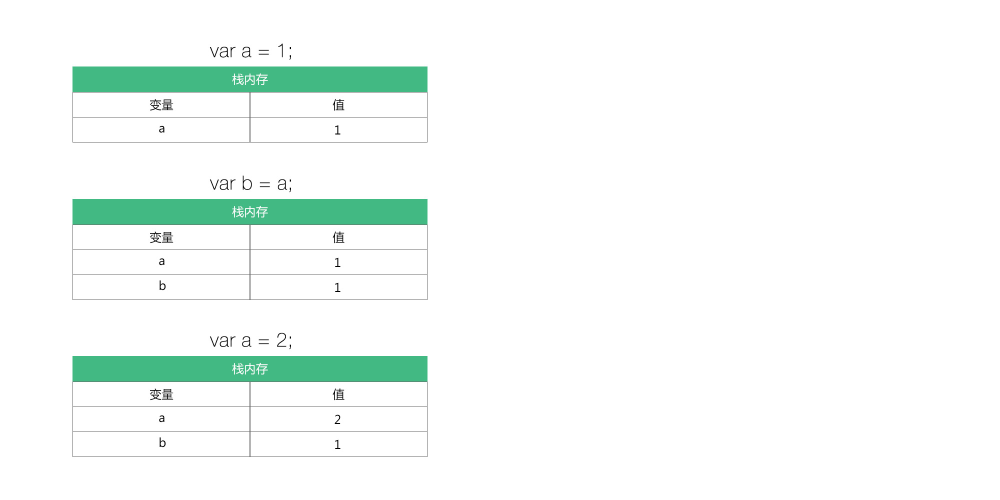
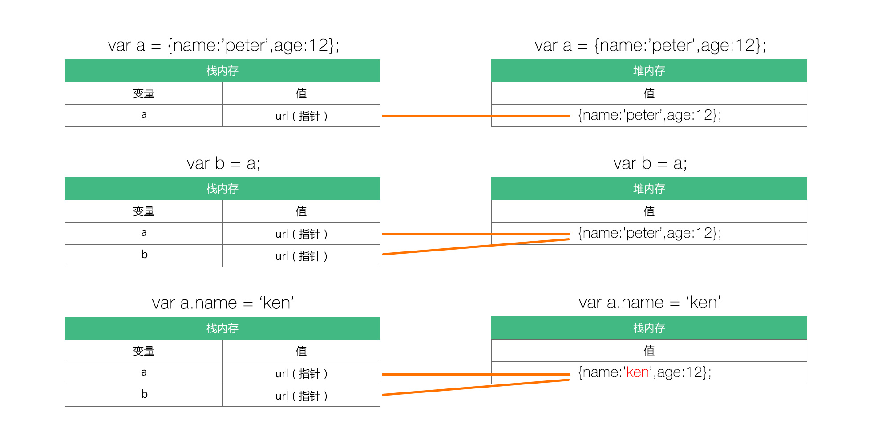

## 数据类型

<br>
<br>

Javascript 中的数据类型大致分为以下几种：

记忆简称：<b>SABUNNO</b>

`string` 、 `array`  、 `boolean`  、 `undefined`  、 `number` 、 `null` 、 `object` 


<br>
<br>

#### 简单数据和复杂数据类型

我们可以把以上的数据类型再进行二次分类：
* 简单（基本）数据类型：`string` 、 `number` 、 `boolean` 、 `null` 、 `undefined`
* 复杂（引用）数据类型：`object` 、 `array`

<br>

<b>怎样最简单直接的区分和理解 `简单（基本）数据类型` 和 `复杂（引用）数据类型`？</b>

>简单（基本）数据类型用拷的；<br>
复杂（引用）数据类型用借的

<br>
<br>


<b>简单（基本）数据类型拷贝的例子：</b>

```copy
var a = 'peter';
var b = a;

console.log(a)          //'peter'
console.log(b)          //'peter'

b = 'ken'               

console.log(b)          //'ken'
console.log(a)          //'peter'
```

<br>

<b>为什么 `a` 和 `b` 的值互不影响？<br></b>

>因为简单（基本）数据类型是按值访问的。<br>
访问变量其实就是访问该变量的值。
简单的说，`b = a` 其实是把 `a` 的值拷贝了一份副本，我们修改副本里面的内容，并不会对原本里面的值造成影响。

!>对于这种改 `b` 的时候，`a` 没跟着改变，我们称为 `深拷贝`。

<br>
<br>


<b>复杂（引用）数据类型借用的例子：</b>

```copy
var a = {name:'peter',age:'12'};
var b = a;

b.name = 'ken';
console.log(a.name)         //ken
```
>复杂（引用）的数据类型是按引用访问的。<br>
相当于借过来用的同一个东西。借过来的东西改变了那就真的改变了。

!>对于这种改 `b` 的时候，`a` 也跟着变的情况，我们称为 `浅拷贝`。

<br>
<br>

#### 栈内存和堆内存

简单（基本）数据类型存放于栈内存中；<br>
复杂（引用）数据类型存放于堆内存中；

<br>
<br>

**简单（基本）数据类型在栈中的表现：**

栈：数据大小确定，按值存放。


>简单（基本）数据类型是按值访问的。每个变量的值都是单独独立的。修改之间互不影响。

<br>
<br>

**复杂（引用）数据类型在堆中的表现：**

堆：数据大小不确定，按引用存放。

>复杂（引用）数据类型是按引用访问的。每个变量的值都是一个 `url 指针`，他们指向堆中同一个值。当这个值发生改变的时候，所有指向这个堆的变量也会发生改变。
!>换句话说，你也可以说他们是拷贝，但是拷贝的是同一个 `url 指针`，`url 指针` 指向同一个堆地址的值。


<br>
<br>

#### 数值型-Number
* 整数
* 浮点数

###### 十进制
>我们日常中用的都是十进制

```copy
1.2         //整数
-2          //整数
-1.2        //浮点数
.222e30     //0.222乘以10的30次方
```
<br>

###### 十六进制
>（以 '0x' 开头）

```copy
0x0         //0
0xabcdef    //11259375
0xfff       //4095
```
<br>

###### 八进制
>八进制需要注意到一下几个地方：<br>
'0' 开头，至少有三位数，任何一位数不能超过 '7'，若有一位数超过 '7' 就不能以八进制看待;


```copy
01          //1
010         //8
011         //9
021         //17
01234       //668

0128        //128（第四位数超过 '7' 了，不能以八进制看待了）
```

* 八进制转十进制计算过程

```copy
01234       //4+3*8+2*8²1*8³ = 668
020         //0+2*8 = 16
021         //1+2*8 = 17
```

<br>

###### 特殊值
* 无穷大 Infinity

```copy
无穷大
    无穷大 Infinity
    1.79e309             //1.79 乘以 10 的 309 次方

    Infinity 负无穷大
    1.79e-309            //1.79 乘以 10 的 -309 次方
```

* NaN

```copy
NaN（not a number）
    NaN                  //是唯一一个不能与自身比较的值
    isNaN()              //检测值是否为 'NaN'
```

>NaN 是唯一一个不能与自身比较的值<br>
NaN === NaN   //false<br>

<br>

!>什么情况下会得出值 `NaN` ?

```copy
0/0                     //NaN（ 0 除以 0 的值为 'NaN'）
0/'hello world'         //NaN（ 0 除以 字符串 的值为 'NaN'）
'hello world'/0         //NaN（ 字符串 除以 0 的值为 'NaN'）

====================

/*要注意的是 '0' 与数字之间的运算*/
0/1                     //0
1/0                     //infinite
```

<br>

如何判断一个值是不是 `NaN` ?  
* `isNaN()` 用于判断括号里面的参数是否为 `NaN`;
* `isNaN()` 如果参数里的值不是数值，会强制将这个参数转换成数值（即使用 `Number()` ）再进行判断。;
* `null`（转换成 `0`） 和 `布尔值`（换成 `0` 或者 `1`） 都会被转换成数值，`0` 和 `1` 都是数值，所以 `isNaN()` 会返回 `false`;

各种情况如下：

|函数|结果|原因|
|:---|:---:|:---|
|isNaN(NaN)|true|is not a number|
|isNaN(undefined)|true|undefined(is not a number)|
|isNaN({})|true|object(is not a number)|
|isNaN(null)|false|null -> 0(is a number)|
|isNaN(false)|false|false -> 0(is a number)|
|isNaN(true)|false|true -> 1(is a number)|
|isNaN(37)|false|37(is a number)|
|isNaN('37')|false|Number('37') -> 37(is a number)|
|isNaN('37.37')|false|Number('37.37') -> 37.37(is a number)|
|isNaN('37,5')|true|Number('37,5') -> NaN(is not a number)|
|isNaN(37,5)|false|Number(37,5) -> 37(is a number)|
|isNaN('123asd')|true|Number('123asd') -> NaN(is not a number)|
|isNaN('')|false|Number('') -> 0(is a number)|
|isNaN(' ')|false|Number(' ') -> 0(is a number)|


#### 字符串-string
字符串是存储字符的变量，字符串是引号中的任意文本。
可以使用`单引号`或者`双引号`

```copy
var name = 'peter';     //使用单引号
var name = "peter";     //使用双引号
```

单引号里面可以有双引号，双引号里面可以有单引号。
```copy
var name = 'He is "peter"'      //He is "peter"
var name = "He is 'peter'"      //He is 'peter'
```

单（双）引号里面有单（双）引号需要转义。
```copy
var name = 'He is \'peter\''        //He is 'peter'
```

其它的转义情况

| 代码 | 输出 |
|:---:|:---:|
|\'|单引号|
|\"|双引号|
|\\|斜杠|
|\n|换行|
|\r|回车|
|\t|tab（制表符）|
|\b|推格符|
|\b|换页符|

#### 布尔 boolean
布尔类型只能有两个值，`true` 和 `false`。
```copy
var x = true;
var y = false;
```
>0,null,undefined,空字符串的时候，布尔值为 `false`。任何有值的字符串都为 `true`。<Br>
`空字符串`也表示有值，为 `true`。


#### 总结


深拷贝和浅拷贝主要的区别是内存中的储存类型不一样；
栈：自动分配内存，由系统自动释放；
堆：动态分配的内存，大小不确定，不会自动释放内存；